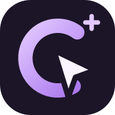

<p align="center"></p>

# clickngoal — a social network for goals and daily progress

**Make progress, find your people, and build something together.**

[Open the app](https://goal.clickn.dev/) · [Install & downloads](https://jabrailkhalil.github.io/clickngoal/) · [Русский](README.ru.md) · [Report an issue](https://github.com/jabrailkhalil/clickngoal/issues)


clickngoal combines a goal tracker, habit calendar and social network. Record a small daily step, see which goals still need attention today, share progress when you choose, and support people pursuing similar interests. The hosted application is available in Russian and English.

## Platforms and installation

| Platform | Available today | How to install or open |
| --- | --- | --- |
| iPhone / iOS | Browser + home-screen web app (PWA) | Open [goal.clickn.dev](https://goal.clickn.dev/) in Safari → Share → Add to Home Screen → enable **Open as Web App**, if offered → Add. |
| iPad / iPadOS | Browser + home-screen web app | Use Safari and Add to Home Screen. |
| Android | Browser, PWA, signed APK | Use Chrome's Install app action or [download the official APK](https://github.com/jabrailkhalil/clickngoal/releases/latest/download/clickngoal.apk). |
| Windows | Browser + PWA | Open in Chrome or Edge; use Install app when offered. |
| macOS | Browser + web app | Use a supported Chrome/Edge install action, or Safari's Add to Dock on supported macOS versions. |
| Linux | Browser + PWA | Open in a modern browser; use a supported Chromium-based browser to install. |
| ChromeOS | Browser + PWA | Open in Chrome and use Install app. |

The same hosted account and social data are available across these platforms. An internet connection is needed for sign-in and shared data. Installation and notifications vary by browser. The iPhone app is installed from the web; there is currently no App Store package. The Android APK uses the shared web interface inside the official Android shell, with native integrations.

Instructions remain on the [downloads page](https://jabrailkhalil.github.io/clickngoal/). Dismissing an installation banner does not remove your ability to install later. See [platform details](guides/platforms.md).

## What the hosted application can do

- Personal and shared goals, daily completion marks and progress notes.
- A calendar with consistent completed-day and streak calculations.
- Profiles, activity feeds, communities, comments and reactions.
- Visibility controls, blocking and a setting to hide your own reports in the feed.
- Achievements and reminders; availability depends on settings and platform.
- Email/password and Telegram sign-in, Russian/English, light/dark/device themes.
- Browser/PWA and Android clients sharing one web interface.

See [the feature guide](guides/features.md) and [architecture](guides/architecture.md) for the boundaries of each distribution.

## What is open source here?

This repository is the **open-source foundation of clickngoal**, licensed under MIT. It contains real extracted application modules, tests, public domain types and a working local community demo. You can inspect, reuse, modify and contribute to this code.

The complete source of the hosted service is not published here. Its authentication backend, production database, moderation tooling, private features and infrastructure are outside this repository. Downloading the official Android binary does not grant an MIT license to unpublished source. The hosted service and binary are governed by the [application terms](https://goal.clickn.dev/terms.html) and [privacy policy](https://goal.clickn.dev/privacy.html).

| Location | Purpose |
| --- | --- |
| `src/core/progress-days.ts` | Deduplicated completion dates, current streak and best streak. |
| `src/core/progress-calendar.ts` | Keyboard calendar navigation with date keys and DST-safe arithmetic. |
| `src/core/use-local-today.ts` | Local midnight/resume handling without network polling. |
| `src/core/use-system-dark.ts` | Live system-theme changes with listener cleanup. |
| `src/core/community.ts` | Public goal/report/comment types and immutable local-demo operations. |
| `src/App.tsx` | Accessible demo: goals, calendar, local progress reports, feed and comments. |
| `guides/` | Product, installation, architecture and release documentation. |
| `docs/` | Bilingual GitHub Pages website, download links and public counters. |

## Downloads that remain available

| Entry | What it is | Download |
| --- | --- | --- |
| Live web / PWA | The real social network; no archive required | [Open and install](https://goal.clickn.dev/) |
| `clickngoal.apk` | Official signed Android application | [Latest APK](https://github.com/jabrailkhalil/clickngoal/releases/latest/download/clickngoal.apk) |
| `clickngoal-web.zip` | Built public demo; stores demo data on your device | [Web demo ZIP](https://github.com/jabrailkhalil/clickngoal/releases/latest/download/clickngoal-web.zip) |
| `clickngoal-source.zip` | Source of the public foundation, tests and guides | [Public source ZIP](https://github.com/jabrailkhalil/clickngoal/releases/latest/download/clickngoal-source.zip) |
| `SHA256SUMS.txt` | Hashes of these three packages | [Verify downloads](https://github.com/jabrailkhalil/clickngoal/releases/latest/download/SHA256SUMS.txt) |

Older packages stay in [Releases](https://github.com/jabrailkhalil/clickngoal/releases). Stable `latest/download/…` links follow the newest published release. The web ZIP is a local demonstration, not an offline copy of hosted accounts.

GitHub counts uploaded release-file downloads, including repeated downloads. The website totals the APK, web ZIP and source ZIP across release pages. These are **file downloads, not people or PWA installations**. Installing a PWA on iPhone is a browser action, not a ZIP download. Automatic GitHub “Source code” archives do not provide this asset counter, so a separate public-source ZIP is attached. Counters may refresh with a delay; API failures show unavailable rather than an invented number.

## Run the public demo

Requirements: Node.js **22.12+** (or supported newer Node), npm. Python 3 is optional, for ZIP packaging only.

```bash
git clone https://github.com/jabrailkhalil/clickngoal.git
cd clickngoal
npm ci
npm run dev
```

Open the local Vite URL. Fictional community posts are examples, and your edits stay in this browser's storage. There is no production API connection or authentication. Clearing browser storage removes demo data; this is not a multi-user backend.

```bash
npm run check               # core tests, strict TypeScript and web build
npm run build               # portable static demo in dist/
npm run site                # copies demo to docs/demo/ for GitHub Pages
python3 scripts/package.py  # packages public web/source ZIPs in release/
```

For the downloaded web ZIP, extract it and run `python3 -m http.server 8080` inside the extracted folder, then visit `http://localhost:8080/`. HTTP is required; double-clicking HTML is unreliable for JavaScript modules. Full multi-user self-hosting is not available from this foundation release.

## Contribute

Read [CONTRIBUTING.md](CONTRIBUTING.md). Accessibility checks, translations, calendar edge cases and small reusable components are welcome. Use [Issues](https://github.com/jabrailkhalil/clickngoal/issues) for reproducible problems and proposals. Pull requests target this public foundation; production access is never needed.

The [roadmap](guides/roadmap.md) separates current features from proposals. Community code will be published in reviewed increments, without exposing private production history. Security reports follow [SECURITY.md](SECURITY.md).

Built by [Jabrail Khalilov](https://github.com/jabrailkhalil), part of [clickn.dev](https://clickn.dev/).
